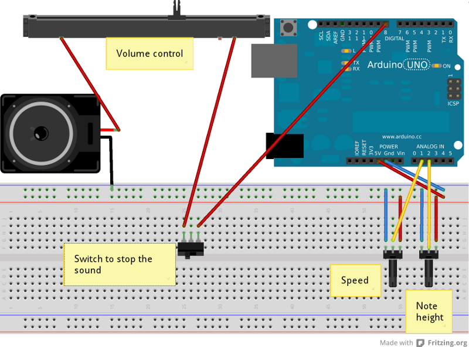

SpeedHeightMuziq
================

Simple control of volume, speed, and note height of a very simple melody.

[See it at work](http://youtu.be/jTXfZN520YY)

##### Component list:

1 	Arduino

2 	Rotary Potentiometer

1 	Slide Potentiometer

1 	Toggle Switch

1 	Loudspeaker

